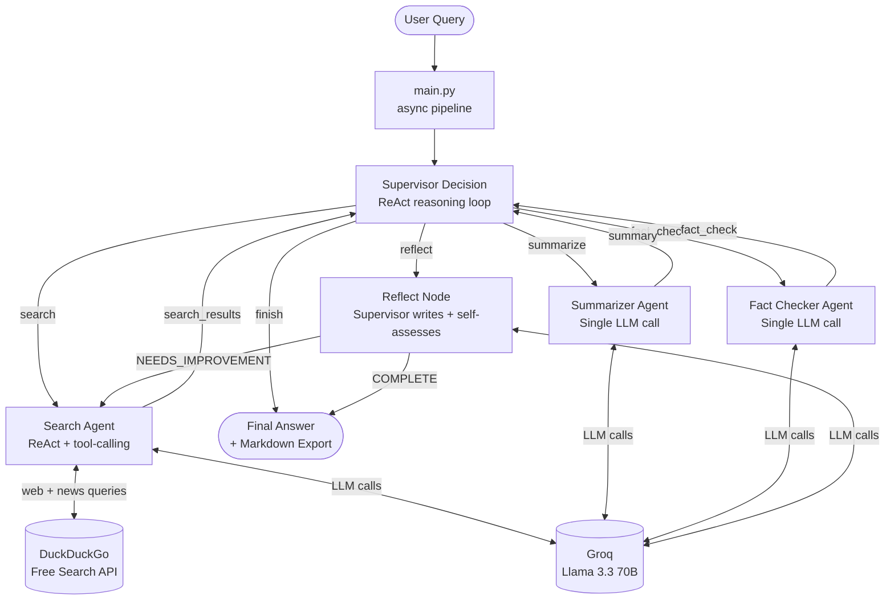

# Multi-Agent Research Assistant

[](https://github.com/vasu356/research-assistant/actions/workflows/ci.yml)
[](https://www.python.org)
[](https://langchain-ai.github.io/langgraph/)
[](https://console.groq.com)
[-red)](https://duckduckgo.com)
[](#testing)
[](LICENSE)

A **production-grade multi-agent research system** built with **LangGraph** that orchestrates four specialised AI agents under a hierarchical supervisor to produce deep, fact-checked research answers — complete with self-reflection and iterative quality improvement.

---

## Problem Statement

Large language models are powerful but have three critical weaknesses when used for research:

1. **Stale knowledge** — training cutoffs mean they miss recent events.
2. **Hallucination** — they confidently produce plausible-sounding but incorrect claims.
3. **Monolithic outputs** — a single LLM call mixes retrieval, reasoning, and synthesis, making quality control impossible.

This project solves all three by decomposing research into a **pipeline of specialised agents**: each agent has one job, a defined input/output contract, and is evaluated by peers before results reach the user.

---

## Features

| Feature | Description |
|---------|-------------|
| 🏗️ **Hierarchical delegation** | Supervisor routes work to specialists; never does research itself |
| 🔄 **ReAct pattern** | Agents reason → act → observe in autonomous loops |
| 🌐 **Real-time web search** | DuckDuckGo integration — no API key, no cost |
| ✅ **Claim-by-claim fact-checking** | Confidence scoring (HIGH / MEDIUM / FLAG) on every major claim |
| 🔁 **Self-reflection & refinement** | Supervisor reviews its own answer and can trigger a re-search pass |
| 🛡️ **Infinite-loop protection** | Hard iteration cap with heuristic fallback routing |
| 📁 **Markdown export** | Timestamped research files saved automatically |
| ⚙️ **Fully configurable** | All tuneable values in `.env` — model, temperature, timeouts, result counts |
| 🧪 **38 offline tests** | Complete test suite with mocked LLM and tools — no network or API key required |
| 🐳 **Docker-ready** | Multi-stage Dockerfile with non-root user and volume mount |
| 🔁 **GitHub Actions CI** | Lint, format check, type check, and test matrix (3.10 / 3.11 / 3.12) |

---

## Architecture

### System Overview



### Agent Responsibilities

| Agent | Role | Pattern | Tools |
|-------|------|---------|-------|
| **Supervisor** | Orchestrates workflow; evaluates completeness; routes to next agent | ReAct + Self-Reflection | LLM reasoning only |
| **Search** | Retrieves fresh web information; formulates multi-query search strategy | ReAct + tool-calling | `duckduckgo_search`, `duckduckgo_news_search` |
| **Summarizer** | Converts raw search results into structured markdown with sources | Single LLM call | LLM only |
| **Fact Checker** | Validates every claim; assigns confidence levels; flags uncertainties | Single LLM call | LLM only |

### Typical Request Flow

```
Query →
  [Supervisor: "I need to search first"] →
    [Search: web + news queries, 2-4 tool calls] →
  [Supervisor: "Now summarize"] →
    [Summarizer: structured markdown] →
  [Supervisor: "Now fact-check"] →
    [Fact Checker: claim-by-claim table] →
  [Supervisor: "Now reflect"] →
    [Reflect: write final answer + self-assess → COMPLETE] →
Final Answer + Markdown file
```

---

## Folder Structure

```
research-assistant/
├── agents/                   # Specialist agent implementations
│   ├── __init__.py
│   ├── fact_checker.py       # Fact Checker Agent
│   ├── search_agent.py       # Web Search Agent (ReAct)
│   ├── summarizer.py         # Summarizer Agent
│   └── supervisor.py         # Supervisor Agent + routing functions
├── config/                   # Centralised configuration
│   ├── __init__.py
│   └── settings.py           # All env-driven settings (single source of truth)
├── docs/                     # Project documentation
│   ├── API.md                # Agent contracts, state schema, tool specs
│   ├── Architecture.md       # Design patterns, Mermaid diagrams, extensibility
│   ├── Contributing.md       # Development workflow and coding standards
│   ├── Deployment.md         # Local, Docker, and cloud deployment
│   └── Troubleshooting.md    # Common issues and debug guide
├── graph/                    # LangGraph state and workflow
│   ├── __init__.py
│   ├── state.py              # ResearchState TypedDict schema
│   └── workflow.py           # StateGraph construction and LLM factory
├── tests/
│   ├── __init__.py
│   └── test_end_to_end.py    # 38 tests: unit + integration + e2e (all offline)
├── tools/
│   ├── __init__.py
│   └── search_tools.py       # LangChain @tool definitions (DDG web + news)
├── research_outputs/         # Auto-created: timestamped markdown exports
├── .env.example              # All configuration options documented
├── .github/
│   ├── workflows/ci.yml      # GitHub Actions: lint + test + type-check
│   └── ISSUE_TEMPLATE/       # Bug report and feature request templates
├── Dockerfile                # Multi-stage build, non-root user
├── docker-compose.yml
├── main.py                   # CLI entry point
├── pyproject.toml
├── requirements.txt
└── ruff.toml                 # Linter and formatter configuration
```

---

## Tech Stack

| Component | Technology | Why |
|-----------|-----------|-----|
| Agent orchestration | [LangGraph](https://langchain-ai.github.io/langgraph/) | Stateful DAG with conditional edges; production-grade multi-agent support |
| LLM framework | [LangChain](https://python.langchain.com) | Tool-binding, message abstractions, provider portability |
| LLM provider | [Groq](https://groq.com) + Llama 3.3 70B | Sub-second inference; free tier; strong instruction-following |
| Web search | [DuckDuckGo (ddgs)](https://pypi.org/project/ddgs/) | No API key required; covers both web and news |
| Configuration | `python-dotenv` + `config/settings.py` | Single source of truth; validated at startup |
| Async runtime | `asyncio` | Non-blocking LLM calls; all agents run in the same event loop |
| Testing | `pytest` + `unittest.mock` | 38 offline tests covering unit, integration, and E2E scenarios |
| Linting | [ruff](https://docs.astral.sh/ruff/) | 10–100× faster than flake8/black; single tool for lint + format |
| CI/CD | GitHub Actions | Lint, format, type-check, test matrix across Python 3.10–3.12 |
| Containerisation | Docker (multi-stage) | Reproducible builds; non-root runtime user; volume for outputs |

---

## Quick Start

### Prerequisites

- Python 3.10+ 
- A free [Groq API key](https://console.groq.com/keys) (takes 30 seconds)

### Setup

```bash
git clone https://github.com/vasu356/research-assistant.git
cd research-assistant

python -m venv .venv
source .venv/bin/activate   # Windows: .venv\Scripts\activate
pip install -r requirements.txt

cp .env.example .env
# Set GROQ_API_KEY=your_key in .env
```

### Run

```bash
# Default query (LLM reasoning models 2025)
python main.py

# Custom query
python main.py "What are the key differences between RAG and fine-tuning for LLMs?"

# With debug logging
LOG_LEVEL=DEBUG python main.py "Your query"
```

### Docker

```bash
docker build -t research-assistant .
docker run --env-file .env -v $(pwd)/research_outputs:/app/research_outputs \
  research-assistant "Your query here"
```

---

## Configuration

All tuneable parameters live in `.env`. Copy `.env.example` to get started.

```bash
# Required
GROQ_API_KEY=gsk_...

# Optional — shown with defaults
GROQ_MODEL=llama-3.3-70b-versatile
GROQ_TEMPERATURE=0.1
GROQ_MAX_TOKENS=4096
GROQ_TIMEOUT=60
MAX_ITERATIONS=6
MAX_TOOL_ITERATIONS=4
SEARCH_MAX_RESULTS=6
NEWS_MAX_RESULTS=5
OUTPUT_DIR=research_outputs
LOG_LEVEL=INFO
```

---

## Testing

```bash
# Run all 38 tests (no network or API key required — fully mocked)
python -m pytest tests/ -v

# With coverage report
pip install pytest-cov
python -m pytest tests/ --cov=agents --cov=graph --cov=tools --cov-report=term-missing

# Direct runner with coloured output
python tests/test_end_to_end.py
```

### Test Coverage

| Test Class | What it tests |
|-----------|--------------|
| `TestStateSchema` | Initial state fields and defaults |
| `TestSearchTools` | Tool registry, graceful error handling |
| `TestSupervisorRouting` | All routing functions, heuristic fallback, state summary |
| `TestWorkflowGraph` | Graph compiles, all nodes registered, edge count |
| `TestSearchAgentNode` | Tool-calling loop, error propagation |
| `TestSummarizerAgentNode` | Summary generation, empty-input guard, error handling |
| `TestFactCheckerAgentNode` | Report generation, empty-input guard |
| `TestSupervisorNodes` | JSON parsing, max-iteration hard stop, bad-JSON fallback, reflect split |
| `TestEndToEndWorkflow` | Full pipeline run, field population, node visit order, infinite-loop guard |

---

## Design Decisions

**Why LangGraph over vanilla LangChain?**
LangGraph gives explicit, inspectable control over routing logic via conditional edges. The graph is a first-class object you can visualise, test the topology of, and reason about independent of the LLM calls.

**Why a shared LLM instance?**
`functools.partial` injects the single `ChatGroq` object into every node. Retry config, timeout, and model selection are set in one place. Swapping to a different provider requires changing exactly one function (`get_llm()`).

**Why DuckDuckGo instead of a paid search API?**
Zero cost, zero API key friction for contributors and evaluators. The tool registry (`TOOLS_BY_NAME`) makes it trivial to swap in Tavily, Serper, or Bing without touching agent code.

**Why TypedDict for state instead of Pydantic?**
LangGraph's `StateGraph` natively works with `TypedDict` for partial updates. Pydantic would require model copying on every node return — TypedDict partial dicts are lighter and idiomatic for LangGraph.

**Why `Annotated[List[str], operator.add]` for messages?**
LangGraph's reducer annotation means the framework automatically accumulates message appends across nodes, rather than overwriting. This gives a complete, chronological activity log without any merge logic in node code.

---

## Output Example

After running, results appear in both the terminal and a timestamped file:

```
research_outputs/
└── research_20250622_142301_What_are_the_latest_developments_in_LLM.md
```

Each file contains:
- Original query and timestamp
- Raw search results (all retrieved web + news content)
- Structured summary (themed sections, key findings, statistics)
- Fact-check report (confidence table, flagged issues, recommendations)
- Self-reflection notes (quality assessment, verdict)
- Final polished answer (executive summary, detailed findings, caveats)
- Workflow metadata (iteration count, message log)

---

## Future Improvements

- **Streaming API** — expose the agent pipeline as a FastAPI endpoint with SSE streaming
- **Pluggable search backends** — Tavily, Serper, Bing with a provider abstraction layer
- **Persistent memory** — store past research in a vector database for cross-session retrieval
- **Citation tracking** — propagate source URLs through the pipeline to the final answer
- **Parallelism** — run multiple sub-searches concurrently using `asyncio.gather`
- **Evaluation framework** — automated quality scoring against a ground-truth question set
- **Model switching** — hot-swap the LLM per-agent (fast model for search, large for synthesis)

---

## Documentation

| Document | Description |
|----------|-------------|
| [Architecture.md](docs/Architecture.md) | Design patterns, Mermaid diagrams, sequence diagrams, extensibility guide |
| [API.md](docs/API.md) | Agent contracts, state schema, tool specs, configuration reference |
| [Deployment.md](docs/Deployment.md) | Local, Docker, and cloud deployment instructions |
| [Troubleshooting.md](docs/Troubleshooting.md) | Common issues, debug logging, error explanations |
| [Contributing.md](docs/Contributing.md) | Development setup, coding standards, PR guidelines |

---

## License

MIT License — see [LICENSE](LICENSE).

---

## Author

**Vasu Agrawal** — Decision Scientist & Backend Engineer  
[LinkedIn](https://www.linkedin.com/in/vasu-agrawal-m26a2003y) · [GitHub](https://github.com/vasu356)
