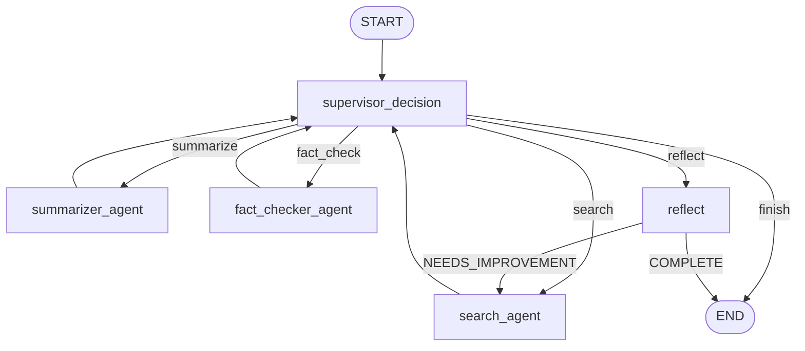
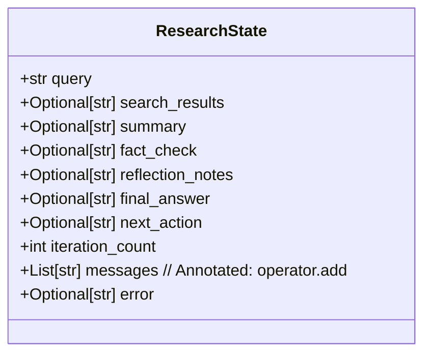
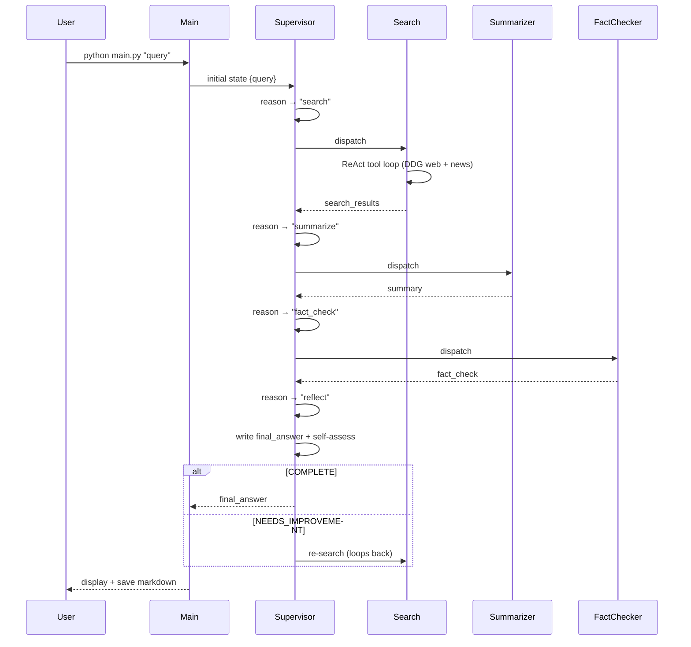
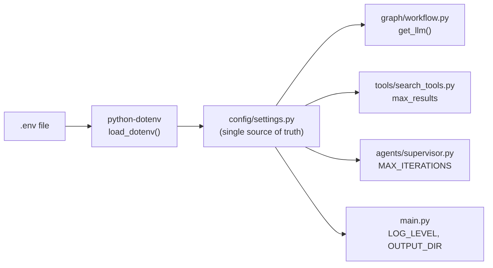

# Architecture

## Overview

The Multi-Agent Research Assistant is built around **LangGraph's StateGraph**, a directed acyclic graph (DAG) with conditional edges that implements a supervisor-driven multi-agent pattern. All agents share a single typed state object that flows through the graph; each node reads the state it needs and writes back a partial update.

---

## Design Patterns

### 1. Supervisor-Worker Hierarchy

The **Supervisor Agent** never does research itself. Its sole job is to evaluate the current workflow state and decide which specialist worker to call next. This separation means:

- The supervisor's reasoning is decoupled from domain execution.
- Workers are fully interchangeable — swapping the search engine requires only changing `tools/search_tools.py`.
- The routing logic is testable independently of any LLM.

### 2. ReAct (Reason + Act)

Both the **Supervisor** and the **Search Agent** implement the ReAct loop:

```
Thought → Action → Observation → Thought → …
```

The Supervisor reasons about state completeness; the Search Agent reasons about query strategy. Both terminate when they decide they're done, rather than being controlled by external counters.

### 3. Self-Reflection

After all research components are gathered, the Supervisor synthesises a draft answer and then evaluates its own output. If the verdict is `NEEDS_IMPROVEMENT`, the graph loops back to the search agent for an additional pass. A hard iteration cap (`MAX_ITERATIONS`) prevents infinite loops.

### 4. Shared Immutable LLM Instance

A single `ChatGroq` instance is created at startup and injected into every node via `functools.partial`. This means:

- One set of connection parameters / retry config.
- Easy to swap to a different provider (OpenAI, Anthropic, etc.) by changing `get_llm()`.

---

## Graph Topology



### Node Descriptions

| Node | Agent | Input fields read | Output fields written |
|------|-------|-------------------|-----------------------|
| `supervisor_decision` | Supervisor | all fields | `next_action`, `iteration_count` |
| `search_agent` | Search | `query` | `search_results` |
| `summarizer_agent` | Summarizer | `query`, `search_results` | `summary` |
| `fact_checker_agent` | Fact Checker | `query`, `summary`, `search_results` | `fact_check` |
| `reflect` | Supervisor | all fields | `final_answer`, `reflection_notes`, `next_action` |

---

## State Schema



`messages` uses `Annotated[List[str], operator.add]` — LangGraph automatically accumulates appends from all nodes rather than overwriting the list.

---

## Request Sequence



---

## Configuration Architecture

All tuneable values live in `config/settings.py` and are sourced from environment variables. No magic strings are scattered across agent files.



---

## Error Handling Strategy

Every agent node wraps its LLM call in a `try/except` block and returns a partial state update even on failure. This means:

- The graph never crashes mid-workflow.
- Error strings are stored in `state["error"]` and `state["messages"]`.
- The Supervisor can observe the error and decide to retry or finish gracefully.

The Search Agent's DuckDuckGo tools also return descriptive error strings rather than raising, keeping the ReAct loop alive even under network issues.

---

## Extensibility

### Adding a New Agent

1. Create `agents/my_agent.py` with an async node function `(state, llm) -> Dict`.
2. Register in `graph/workflow.py`: `graph.add_node("my_agent", partial(my_agent_node, llm=llm))`.
3. Add a routing case in `supervisor.py`'s `route_after_decision` mapping.
4. Expose a new action string from the Supervisor's decision prompt.

### Swapping the LLM Provider

Replace `ChatGroq` in `graph/workflow.py → get_llm()` with any `BaseChatModel` from LangChain (e.g. `ChatOpenAI`, `ChatAnthropic`). No agent code needs to change.

### Adding Search Tools

Add a new `@tool`-decorated function to `tools/search_tools.py` and include it in `AVAILABLE_TOOLS`. The Search Agent will automatically be able to call it.
